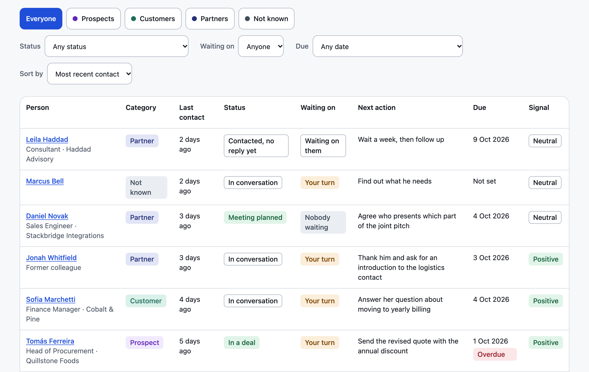
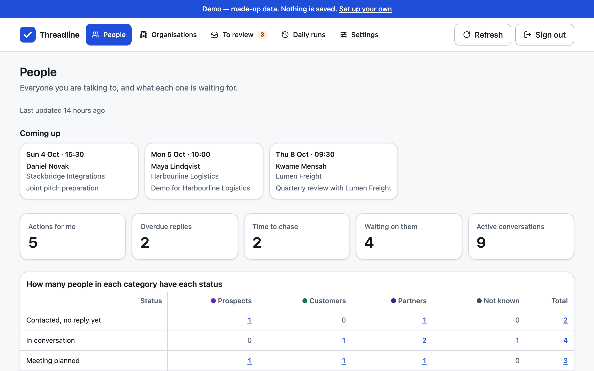
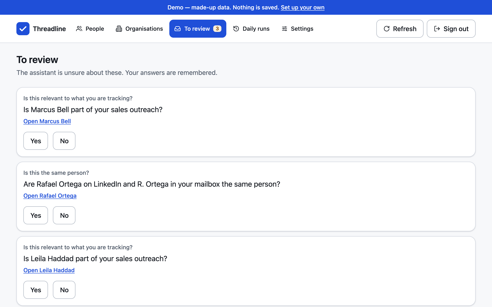
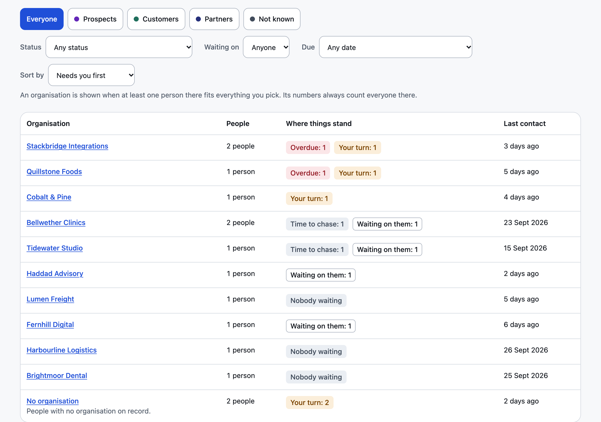
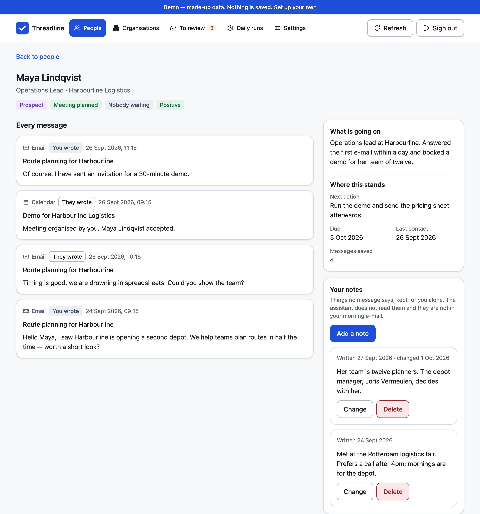
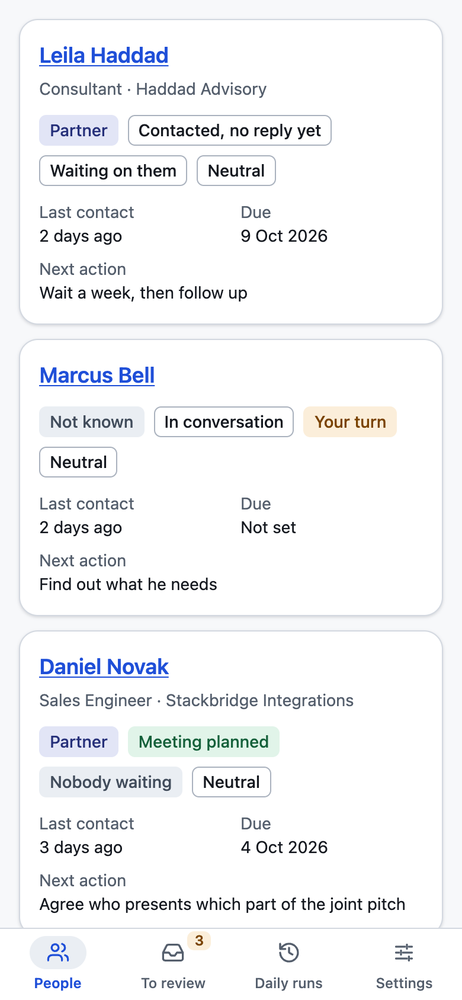

# Threadline

**Every conversation, one clear line.**

[](./LICENSE)

Threadline is a private, self-hosted tool for the conversations you are keeping
alive: who you are talking to, where each conversation stands, who owes whom a
reply, and what to do next.

Once a day it reads your new LinkedIn messages and your mailbox (Gmail,
Outlook.com, iCloud, Yahoo, Fastmail or any IMAP mailbox), plus your Outlook
calendar if you have one, throws away the noise, and groups what is left into
one timeline per person. An AI step, run by Claude on your own subscription,
then judges each person: the status, who is waiting on whom, the next action
and when it is due. You see the result on a private dashboard, and a short
summary e-mail reaches you every morning.

Threadline started as a job-search tool and is being generalised. You pick a
preset — job search, sales outreach, fundraising, freelance clients or general
networking — or define your own categories. See
[`docs/customising.md`](./docs/customising.md).

<picture>
  <source media="(prefers-color-scheme: dark)" srcset="./docs/images/people-list-dark.png">
  
</picture>

## Try the demo

Live demo: <https://try-threadline.vercel.app>

See the dashboard with made-up data before setting anything up. You need
[Node.js](https://nodejs.org) 22 or newer; no accounts and no settings.
Download the code first (the green **Code → Download ZIP** button on this
page), then in a terminal, inside that folder:

```bash
cd frontend
npm install
npm run demo
```

`npm install` may print warnings about vulnerabilities or install scripts: they
concern developer tools only and can be ignored. Then open
<http://localhost:5173>. You are signed in as an invented owner who
does sales outreach. You can correct people, answer the review questions and
change the categories on the Settings page; nothing is saved, and reloading the
page starts again from the same made-up data. A demo build is made with
`npm run build:demo`; a normal build never contains the demo. To put the demo
online as its own website, follow [`docs/demo-site.md`](./docs/demo-site.md).

## What it looks like

The home page, and the questions the AI step was unsure about:

<p>
  
  
</p>

The same people grouped by organisation, so you can see where you stand with
each one as a whole:



One person's page with every message in one timeline, and the people list on
a phone:

<p>
  
  
</p>

Every picture comes from the demo, so every name, company and address in it is
made up.

## What it is, and what it is not

- **It is** a personal tool: one copy per person, on accounts you own.
- **It is** read-only. It never writes to LinkedIn or your mailbox, and never
  sends anything to anybody except the one summary to you.
- **It is not** a CRM, an outreach or auto-reply tool, or a hosted service.
  Never run one copy for several people: the database has a single owner and
  no separation between users.

## Who it is for

Anyone who juggles many one-to-one conversations across LinkedIn and e-mail and
keeps losing track of who is waiting for an answer: job seekers, founders
raising money, freelancers, people doing sales or partnership outreach.

## How it works

```
LinkedIn messages ─────────┐
Gmail, Outlook or any      │
  IMAP mailbox ────────────┼─▶ collect ─▶ drop noise ─▶ group by person ─▶ Claude judges each person
Outlook calendar ──────────┘                                                        │
                                                                                    ▼
                                                           your Supabase database (checked before saving)
                                                                        │
                                                        ┌───────────────┴───────────────┐
                                                        ▼                               ▼
                                               private dashboard              morning summary e-mail
```

Everything runs once a day on GitHub Actions in your own private copy, on your
own Claude subscription, so your computer can be off. There is no server of its
own: the backend is a command-line tool (`tracker`) that a Claude Code session
runs step by step, following
[`.claude/commands/daily-run.md`](./.claude/commands/daily-run.md). A Claude
cloud routine can run the same recipe instead (the alternative route, for
Outlook-only set-ups). The design is described in
[`docs/architecture.md`](./docs/architecture.md).

## What you need

| Item | What it is used for | Cost |
|------|---------------------|------|
| A computer with macOS, Linux or Windows (10 or 11) | Running the set-up once. After that it can stay off | – |
| A paid Claude plan (Pro, Max or Team) | The Claude Code session that runs everything and does the judging. The daily run uses part of your plan's usage limits | Your existing subscription; no separate API key |
| [Claude Code](https://code.claude.com/docs/en/setup), installed (check with `claude --version`) | Making the key that lets GitHub use your plan (`claude setup-token`) | Included in your plan |
| A [GitHub](https://github.com) account | Your private copy of the code, and GitHub Actions, which starts the run every day. The installer adds the [GitHub CLI](https://cli.github.com) (`gh`), which signs you in, makes your copy and saves your settings | Free (2,000 Actions minutes a month for private repositories at the time of writing; a month of runs uses about 150–300) |
| A [Supabase](https://supabase.com) account | The database and the dashboard sign-in. The set-up creates the project with one access token. Its built-in sign-in e-mail only reaches the address the Supabase account was registered with (or members of its organisation) unless you set up your own sending service (custom SMTP) | Free plan |
| A [Netlify](https://www.netlify.com) account | Publishing the dashboard | Free plan |
| At least one mailbox: Gmail, Outlook.com/Hotmail, iCloud, Yahoo, Fastmail or any IMAP mailbox | The mail that is read (read-only). Gmail and the others need an app password, which also sends you the summary; Outlook needs a one-time sign-in | Free (Fastmail: a paid plan above Basic) |
| *Optional:* a Microsoft personal account | The calendar, which is read from Outlook only for now | Free |
| *Optional:* a LinkedIn developer app | Reading your LinkedIn messages; only for members located in the EEA or Switzerland (see below) | Free |
| *Optional:* [Node.js](https://nodejs.org) 22 or newer | Only the manual way of switching on the dashboard's Refresh now button; also needed for the demo above | Free |
| *Optional:* an Azure account | Only to use your own Microsoft application instead of the public one | Free |
| *Only for the Claude cloud route:* a Gmail account connected to Claude | Sending the summary from a Claude cloud routine, when you read Outlook alone | Free |

No other paid service is needed, unless you choose a paid mailbox such as
Fastmail. Setting it up takes about 10 to 15 minutes of your own time if you
already have the accounts, plus a few minutes to create any you lack. The first
summary e-mail arrives about ten minutes after the set-up ends.

### LinkedIn: only in the EEA and Switzerland

LinkedIn's official API for exporting your own messages (Member Data
Portability) is available only to members located in the European Economic
Area and Switzerland. Elsewhere, leave LinkedIn out: everything else works
without it.

LinkedIn's copy of your messages also runs one to two days behind, so a
LinkedIn message reaches Threadline a day or two after you receive it. Mail and
calendar entries are read as they are at the moment of the run.

## Set it up

**The easy way: let Claude do it.** You already need a Claude plan, and
Claude can run the whole set-up for you: install the tools, make your private
copy, start the guided set-up and check the result, while you create the
accounts and click where it says. Keys go into a page in your browser, never
into the chat. See [`docs/setup-with-claude.md`](./docs/setup-with-claude.md):
it is one sentence to paste into the Claude app.

**By hand:** create free GitHub, Supabase and Netlify accounts first, and
install [Claude Code](https://code.claude.com/docs/en/setup). Then paste one
line into a terminal.

On macOS or Linux:

```bash
curl -LsSf https://raw.githubusercontent.com/roccoterr97/threadline/main/install.sh | sh
```

On Windows, in PowerShell:

```powershell
irm https://raw.githubusercontent.com/roccoterr97/threadline/main/install.ps1 | iex
```

What happens next:

1. The installer adds uv and the GitHub CLI if they are missing (and Git, on
   Windows), signs you in to GitHub in the browser, makes your private copy
   called `threadline`, downloads it to `~/threadline`, and starts the guided
   set-up. Pasting the line again carries on where it stopped.
2. The set-up runs 11 steps. With one Supabase access token it creates your
   project, builds the database, creates your dashboard login and switches
   sign-ups off. It then asks for your categories, time zone and mailbox,
   publishes the dashboard, and asks for the daily time.
3. Last, it saves your settings and your Claude key on GitHub, starts the first
   run, and checks every connection. The first summary e-mail arrives about ten
   minutes later, then every day at the time you chose.
4. LinkedIn, the dashboard's Refresh now button and the Claude cloud route are
   optional extras: `uv run tracker setup extras`, any time. Refresh now also
   switches on the on-time morning start: GitHub often starts its scheduled
   runs hours late, so your Supabase project starts the daily run at your time
   instead, and GitHub's own schedule stays as a backup.

Add `--browser` to any `uv run tracker setup` command to have the questions
asked on a page in your web browser instead of in the terminal: keys go into
hidden fields, and the page is served to your computer only.

[`docs/setup-your-accounts.md`](./docs/setup-your-accounts.md) walks through
every step, with what you should see and a short list of the words it uses
(IMAP, app password, secrets…). To come back to the set-up later, open a
terminal and type `cd ~/threadline/backend`, then `uv run tracker setup`.

Day-to-day operation — what to do when something fails, renewing the LinkedIn
key and the yearly Claude key, redoing the Microsoft sign-in, changing the time,
pausing and resuming — is in
[`docs/operations.md`](./docs/operations.md).

## Command reference

Run every command from the `backend/` folder as `uv run tracker …`.
`uv run tracker --help`, or `--help` after any command, shows the same
information.

### Setup and checks

| Command | What it does |
|---------|--------------|
| `tracker setup` | The guided set-up: every unfinished core step in order, then a final check of every connection. Running it again carries on where it stopped |
| `tracker setup extras` | The optional steps, in order, each skippable: `linkedin`, `refresh` and `cloud` |
| `tracker setup <step>` | Run one step alone, even if it was done before. The core steps, in order, are `supabase`, `encryption`, `database`, `login`, `categories`, `timezone`, `mailbox`, `microsoft`, `dashboard`, `schedule` and `github`; the extras are `linkedin`, `refresh` and `cloud` |
| `tracker setup [<step>] --browser` | The same, asked on a page in your web browser instead of the terminal; what is said and asked is still shown in the terminal, answers never are |
| `tracker setup supabase` | Create your Supabase project (or reuse one) with one access token, and save its address and keys; the token is never saved. Typing an existing project's address and keys is also offered |
| `tracker setup mailbox` | Choose the mailbox to read; for Gmail and other IMAP mailboxes, check an app password live and store it encrypted (for a custom provider it also asks for the sending server, SMTP host and port) |
| `tracker setup schedule` | Write the daily time and time zone into the GitHub workflow, and into the database for the on-time morning start; commit and push the workflow only after a yes |
| `tracker setup github` | Save your settings and the Claude key as your repository's Actions secrets and variables (with `gh`), or list the names to add by hand; settings you cleared locally are removed from GitHub too. With `gh` it then switches the workflow on and starts the first daily run after a yes. It only ever uses your own private copy |
| `tracker setup refresh` | Switch on the dashboard's Refresh now button: deploy the `refresh-now` function and its settings through Supabase's Management API, with a GitHub key that can only start your workflow. It also switches on the on-time morning start: a timer in your database that starts the daily run at its time, every 15 minutes checking whether it is due |
| `tracker setup cloud` | The Claude cloud route, the alternative to GitHub: what a Claude cloud routine needs |
| `tracker doctor` | Check that every account and setting is in order |
| `tracker sample load` | Write made-up sample records, their dates moved so they look as fresh today as on the day the sample was written; running it twice changes nothing |
| `tracker sample clear` | Remove the made-up sample records, leaving real data untouched |

### Collecting

| Command | What it does |
|---------|--------------|
| `tracker microsoft login` | Sign in to the mailbox once; the key then renews itself |
| `tracker microsoft forget` | Remove the stored mailbox key, so the next run needs a new sign-in |
| `tracker collect linkedin [--since YYYY-MM-DD] [--show-folders]` | Read the LinkedIn archive and store the recent conversations; `--show-folders` also prints the distinct LinkedIn folder values |
| `tracker collect email [--since YYYY-MM-DD \| --refresh]` | Read every mailbox you set up (Outlook, Gmail…) and store the conversations worth keeping; `--refresh` reads only what is new since the mailboxes were last read successfully |
| `tracker collect calendar` | Read the Outlook calendar and store the meetings with other people |
| `tracker collect all [--since YYYY-MM-DD \| --refresh] [--record] [--run ID]` | Read every source at the same time, then store them one after the other. `--record` also records each source as its step of the run and carries on past a source that failed; with `--refresh` it records into the refresh that is open, never the daily run — this is the command the daily run uses |
| `tracker people list` | Show everybody the collectors have found, most recent first |
| `tracker people merge` | Join the records you have confirmed are one person |
| `tracker people link` | Ask about records that look like one person or one opportunity |
| `tracker people tidy` | `people merge`, then `people link`, as one command; if one fails its code is printed and the other still runs — this is the command the daily run uses |
| `tracker people untangle` | Split up records that were really a shared sender, such as a hiring system |

Without `--since`, the first run reads the last 30 days and later runs continue
from the last successful run.

### Assessment

| Command | What it does |
|---------|--------------|
| `tracker ai export [--limit N] [--batches DIR] [--results DIR] [--record [--refresh]] [--run ID]` | Write one file per group of people who still need a verdict, and make the directory their verdicts go in. `--record` also records the `assess` step of the run when there is nobody to assess; with `--refresh`, into the refresh that is open rather than the daily run |
| `tracker ai import [--results DIR] [--batches DIR] [--record [--refresh]] [--run ID]` | Check the verdict files, save the ones that pass, and delete the files it applied. `--record` also records the `assess` step of the run: people assessed, and how many were sent to review; with `--refresh`, into the refresh that is open rather than the daily run |
| `tracker ai status [--results DIR] [--batches DIR]` | Show what is waiting: people to judge, files to import, questions to answer |
| `tracker ai clean` | Remove every exchanged file, including batches that were never answered |

The judging itself happens in Claude Code with the `/assess` recipe
([`.claude/commands/assess.md`](./.claude/commands/assess.md)); no command
calls an AI service.

### Profile

| Command | What it does |
|---------|--------------|
| `tracker profile choose [--preset NAME] [--guide PATH]` | Pick a preset, keep the suggested categories you use and add your own; saved to the database, and the assessment guide is rebuilt; `--guide PATH` chooses where it is written (default `docs/assessment-guide.md`) |
| `tracker profile check [--file PATH \| --preset NAME]` | Check your profile (or a shipped preset) and print its suggested categories and stage labels; changes nothing |
| `tracker profile apply [--file PATH] [--categories] [--guide PATH]` | Save the stage labels and suggestions and rebuild the assessment guide from your categories (written to `docs/assessment-guide.md`, or to `--guide PATH`); `--categories` also replaces your categories with the file's list |

See [`docs/customising.md`](./docs/customising.md).

### The daily run

| Command | What it does |
|---------|--------------|
| `tracker run start [--trigger github\|cloud\|refresh\|mac\|manual] [--prepare]` | Open today's run and print its identifier (default trigger: `cloud`). `--prepare` goes on to `tracker healthcheck` and `tracker profile apply` and ends with `ready: yes` or `ready: no` — this is how the daily run opens |
| `tracker healthcheck` | The daily run's own check of the configuration, the database and the secret store, run by `run start --prepare`. By hand, `tracker doctor` says more |
| `tracker run step --step STEP --result success\|failed [--found N] [--new N] [--error-code CODE] [--error-detail TEXT] [--run ID \| --refresh]` | Record what one part of the run did. `STEP` is `collect_linkedin`, `collect_email`, `collect_calendar`, `assess` or `summary_email`. `--refresh` records into the refresh that is open rather than the daily run |
| `tracker run finish [--run ID \| --refresh] [--clean]` | Close the run with the status its steps add up to. `--refresh` closes the refresh that is open rather than the daily run. `--clean` then removes the exchanged files, as `tracker ai clean` does — this is how the daily run closes |
| `tracker summary build [--out PATH] [--run ID] [--send-again]` | Write the morning summary to a file, ready to send, and say how it is sent (`delivery: smtp` or `gmail_connector`). When another daily run already sent today's summary it writes nothing, records the e-mail as skipped and prints `summary skipped · …`; `--send-again` builds it anyway |
| `tracker summary send [--file PATH] [--run ID] [--send-again]` | Send that file from your own mailbox by SMTP, exactly as built and only to your configured recipient, and record the step. Like `summary build`, it skips the e-mail when today's summary already went out with another daily run, unless given `--send-again` |

The workflow [`.github/workflows/threadline-run.yml`](./.github/workflows/threadline-run.yml)
runs `/daily-run` every day, or by hand with mode `daily` or `refresh` (new
messages only, no e-mail). Without its secrets it finishes green and does
nothing. With the on-time morning start switched on, your Supabase project
starts the daily run at its time, and a run started by GitHub's own (often
late) schedule stops by itself when the day's run already started
([`docs/refresh-now.md`](./docs/refresh-now.md)).

## Customising

Choose your categories on the dashboard's **Settings** page (it asks before
removing one), or in the terminal with `tracker profile choose`. Categories, presets and wording are explained in
[`docs/customising.md`](./docs/customising.md). What every status and
waiting-on value means is defined in
[`docs/assessment-guide.md`](./docs/assessment-guide.md).

## Privacy and security

- Everything lives in accounts you own: your database, your dashboard, your
  GitHub repository and your Claude subscription. Nothing is sent to the
  project's authors. The Claude key goes only into your own repository's
  secrets; Threadline never stores it.
- The mailbox and calendar are read with read-only permissions. Nothing is
  ever written to LinkedIn or the mailbox.
- Message text is treated as untrusted input. Only a restricted helper with no
  shell and no network reads it, and its answers are validated strictly before
  anything is saved, so an e-mail saying "ignore your instructions" cannot act.
- Conversations judged to be noise keep no subject and no text. The files that
  carry message text to the AI step are deleted once their verdicts are saved.
- The dashboard's public key reads nothing on its own: the database only
  answers the one signed-in owner.
- Notes you type on a person's page are yours alone: they are never sent to
  the AI step and never put in the summary e-mail.

The full model — what is stored where and how untrusted text is contained —
is in [`SECURITY.md`](./SECURITY.md). Report vulnerabilities privately through
GitHub, as described there.

## Folder map

| Folder | What is in it |
|--------|---------------|
| `backend/` | The Python jobs and the `tracker` command-line tool |
| `backend/tests/` | Unit tests; they never touch the network |
| `frontend/` | The dashboard (Vite, React, TypeScript) |
| `supabase/migrations/` | The database structure and its access rules, one file per change |
| `.claude/` | The daily-run and assessment recipes, the assessor helper and the session's permissions |
| `.github/workflows/` | The checks every change must pass, and `threadline-run.yml`, the daily run |
| `docs/` | Setup, operations, architecture, the assessment guide, the coding standards and the README's pictures (`docs/images/`) |

## Development

```bash
cd backend
uv sync
uv run ruff check .
uv run pyright
uv run pytest -q

cd ../frontend
npm ci
npm run lint
npm run typecheck
npm test
npm run build
```

The home-screen icons in `frontend/public/icons/` are drawn by
`npm run icons` from the logo and the colour tokens; run it again after
changing either, and commit the new files.

All of these run in CI on every push and pull request. See
[`CONTRIBUTING.md`](./CONTRIBUTING.md) before opening a pull request, and
[`CLAUDE.md`](./CLAUDE.md) for the engineering standards.

## Licence

[MIT](./LICENSE) © 2026 roccoterr97
